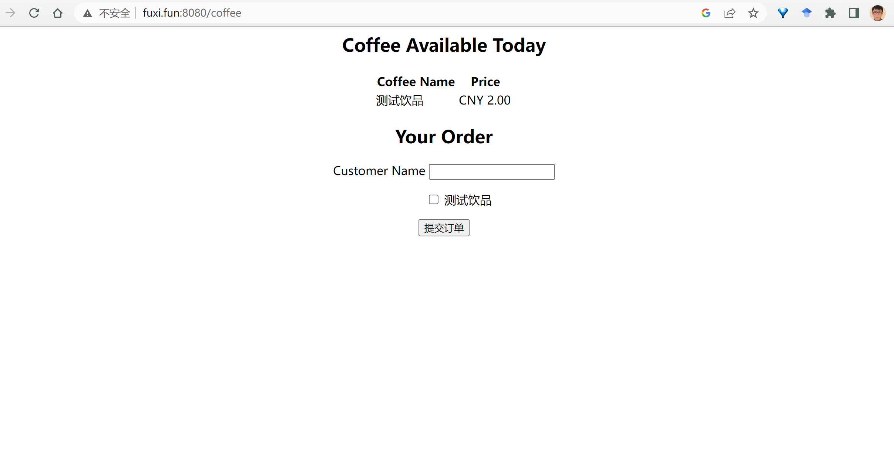
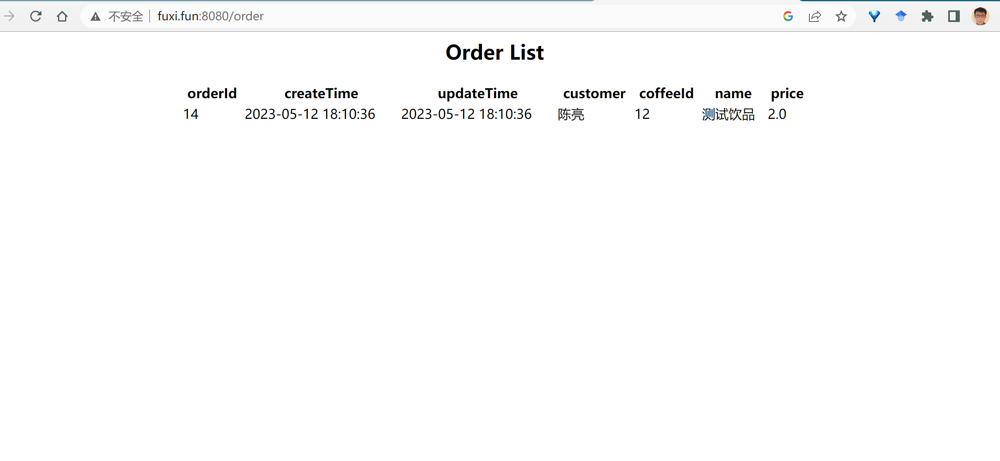
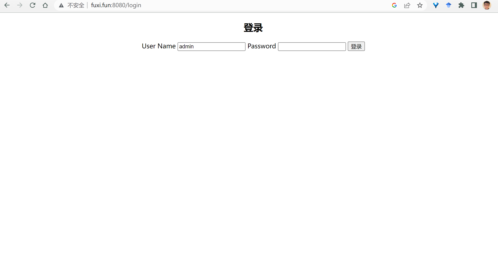

# coffee_order_system

#### 介绍
企业级开发课程作业

#### 软件架构
后端采用SpringBoot，前端采用Themeleaf，使用Shiro框架进行登录验证，对部分数据库字段及配置文件进行加密处理，
数据库使用mysql，最后使用maven管理项目。

#### 安装教程

1.  需安装jdk1.8
2.  需安装maven
3.  需安装mysql并新建对应数据库

#### 使用说明

1.  clone至本地后使用IDEA打开，先进行pom.xml文件install，确保依赖完整安装
2.  配置项选择安装的jdk1.8构建运行
3.  点击绿色三角，运行yangxingruiApplication
4.  打开浏览器访问localhost:8080/coffee，顾客点咖啡

5.  打开浏览器访问localhost:8080/order，顾客查看下单信息

6.  打开浏览器访问localhost:8080/login，管理员登录

#### 参与贡献

1.  感谢xinqi提供课上指导
2.  感谢zipengli提供前期项目框架

#### 特技

1.  使用 Readme\_XXX.md 来支持不同的语言，例如 Readme\_en.md, Readme\_zh.md

